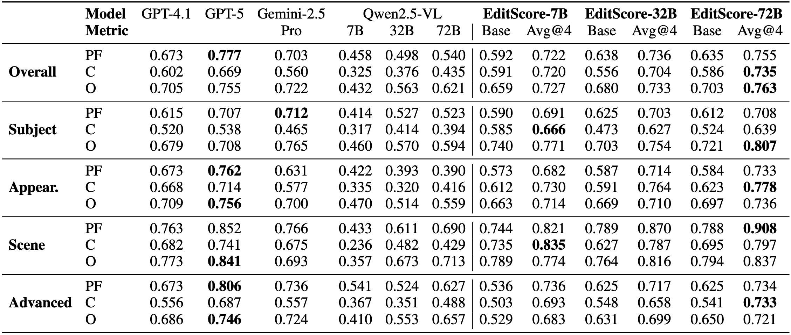
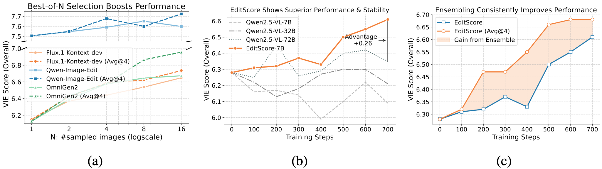

<p align="center">
  
</p>

<p align="center">
  <a href="https://vectorspacelab.github.io/EditScore"></a>
  <a href="https://arxiv.org/abs/2506.18871"></a>
  <a href="https://huggingface.co/EditScore/EditScore-7B"></a>
  <a href="https://huggingface.co/datasets/EditScore/EditReward-Bench"></a>
</p>

<h4 align="center">
    <p>
        <a href=#-news>News</a> |
        <a href=#-quick-start>Quick Start</a> |
        <a href=#-usage-tips>Usage Tips</a> |
        <a href=#-limitations-and-suggestions>Limitations</a> |
        <a href=#-gradio-demo>Online Demos</a> |
        <a href=#%EF%B8%8F-citing-us>Citation</a>
    <p>
</h4>

## 🔥 News
- **2025-09-29**: We release **EditScore** and **EditReward-Bench**, model weights and benchmark can be accessed in [model](https://huggingface.co/collections/EditScore/editscore-68d8e27ee676981221db3cfe) and [benchmark](https://huggingface.co/datasets/EditScore/EditReward-Bench).

## Introduction

**EditScore** is a series of state-of-the-art open-source reward models (7B–72B) designed to evaluate and enhance instruction-guided image editing. While Reinforcement Learning (RL) holds immense potential for this domain, its progress has been severely hindered by the absence of a high-fidelity, efficient reward signal.

To overcome this barrier, we provide a systematic, two-part solution:

- **A Rigorous Evaluation Standard**: We first introduce **EditReward-Bench**, a new public benchmark for the direct and reliable evaluation of reward models. It features 13 diverse subtasks and expert human annotations, establishing a gold standard for measuring reward signal quality.

- **A Powerful & Versatile Tool**: Guided by our benchmark, we developed the **EditScore** model series. Through meticulous data curation and an effective self-ensembling strategy, EditScore sets a new state of the art for open-source reward models, even surpassing the accuracy of leading proprietary VLMs.

<p align="center">
  
  <br>
  <em>Benchmark results on EditReward-Bench.</em>
</p>

We demonstrate the practical utility of EditScore through two key applications:

- **As a State-of-the-Art Reranker**: Use EditScore to perform Best-of-$N$ selection and instantly improve the output quality of diverse editing models.
- **As a High-Fidelity Reward for RL**: Use EditScore as a robust reward signal to fine-tune models via RL, enabling stable training and unlocking significant performance gains where general-purpose VLMs fail.

This repository releases both the **EditScore** models and the **EditReward-Bench** dataset to facilitate future research in reward modeling, policy optimization, and AI-driven model improvement.

<p align="center">
  
  <br>
  <em>EditScore as a superior reward signal for image editing.</em>
</p>

<!-- <p align="center">
  
  <br>
  <em> Good demonstrations of OmniGen2's in-context generation capabilities.</em>
</p> -->


## 📌 TODO
- [ ] RL training code that applying EditScore to OmniGen2.
- [ ] Best-of-N inference scripts for OmniGen2, Flux-dev-Kontext and Qwen-Image-Edit.

## 🚀 Quick Start

### 🛠️ Environment Setup

#### ✅ Recommended Setup

```bash
# 1. Clone the repo
git clone git@github.com:VectorSpaceLab/EditScore.git
cd EditScore

# 2. (Optional) Create a clean Python environment
conda create -n editscore python=3.12
conda activate editscore

# 3. Install dependencies
# 3.1 Install PyTorch (choose correct CUDA version)
pip install torch==2.7.1 torchvision --extra-index-url https://download.pytorch.org/whl/cu126

# 3.2 Install other required packages
pip install -r requirements.txt
```

#### 🌏 For users in Mainland China

```bash
# Install PyTorch from a domestic mirror
pip install torch==2.7.1 torchvision --index-url https://mirror.sjtu.edu.cn/pytorch-wheels/cu126

# Install other dependencies from Tsinghua mirror
pip install -r requirements.txt -i https://pypi.tuna.tsinghua.edu.cn/simple
```

---

### 🧪 EditScore Usage Example

```python
from PIL import Image
from editscore import EditScore

model_path = "/share/project/jiahao/LLaMA-Factory2/output/merge_v7-2_8models_omnigen2-4samples_gpt4-1_range_0to25"

scorer = EditScore(
    backbone="qwen25vl",
    model_name_or_path=model_path,
    score_range=25,
    num_pass=1, # the number of forward passes, better performance with larger of this value
)

input_image = Image.open("example_images/input.png")
output_image = Image.open("example_images/output.png")
instruction = "Adjust the background to a glass wall."

result = scorer.evaluate([input_image, output_image], instruction)
print(result)
```

---

## Benchmark Your Image-Editing Reward Model
We provide an example script that evaluate Edit-Score on **EditReward-Bench**
```bash
bash evaluate.sh
```

## ❤️ Citing Us
If you find this repository or our work useful, please consider giving a star ⭐ and citation 🦖, which would be greatly appreciated:

```bibtex
@article{wu2025omnigen2,
  title={OmniGen2: Exploration to Advanced Multimodal Generation},
  author={Chenyuan Wu and Pengfei Zheng and Ruiran Yan and Shitao Xiao and Xin Luo and Yueze Wang and Wanli Li and Xiyan Jiang and Yexin Liu and Junjie Zhou and Ze Liu and Ziyi Xia and Chaofan Li and Haoge Deng and Jiahao Wang and Kun Luo and Bo Zhang and Defu Lian and Xinlong Wang and Zhongyuan Wang and Tiejun Huang and Zheng Liu},
  journal={arXiv preprint arXiv:2506.18871},
  year={2025}
}
```
